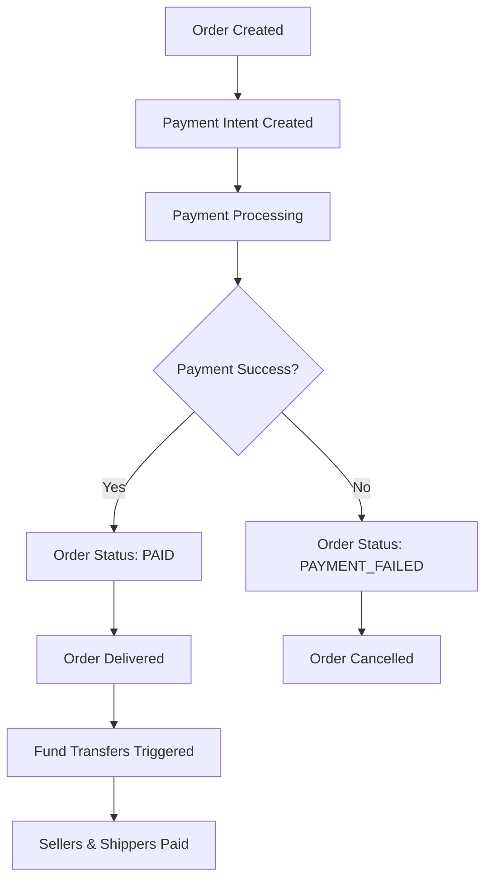

# Stripe Payment Integration Setup

This document outlines the required environment variables and setup for the Stripe payment integration in the order-service.

## Required Environment Variables

Create a `.env` file in the `order-service` directory with the following variables:

```bash
# Stripe Configuration
# Get your API keys from https://dashboard.stripe.com/apikeys
STRIPE_SECRET_KEY=sk_test_your_stripe_secret_key_here
STRIPE_PUBLISHABLE_KEY=pk_test_your_stripe_publishable_key_here

# Stripe Connect Configuration
# Your platform's Stripe account ID for Connect
STRIPE_CONNECT_ACCOUNT_ID=acct_your_connect_account_id_here

# Onboarding URLs
# URLs for Stripe Express account onboarding
STRIPE_ONBOARDING_REFRESH_URL=http://localhost:3000/onboarding/refresh
STRIPE_ONBOARDING_RETURN_URL=http://localhost:3000/onboarding/success

# Webhook Configuration
# Endpoint secret for webhook verification
STRIPE_WEBHOOK_SECRET=whsec_your_webhook_secret_here

# Application Configuration
NODE_ENV=development
PORT=3002
```

## Stripe Setup Steps

1. **Create a Stripe Account**: Sign up at https://stripe.com
2. **Get API Keys**:
   - Go to https://dashboard.stripe.com/apikeys
   - Copy your Publishable key and Secret key
   - Use test keys for development
3. **Enable Stripe Connect**:
   - Go to https://dashboard.stripe.com/connect/accounts
   - Enable Connect for your platform
   - Note your Connect account ID
4. **Set up Webhooks**:
   - Go to https://dashboard.stripe.com/webhooks
   - Create a new endpoint pointing to your application
   - Copy the webhook signing secret

## Features Implemented

The payment module includes the following Stripe features:

### Payment Processing

- Create payment intents
- Confirm payment intents
- Cancel payment intents
- Retrieve payment intent details

### Stripe Connect (Multi-party Payments)

- Create connected accounts for sellers/shippers
- Create account links for onboarding
- Retrieve connected account details
- Create transfers to connected accounts

### Escrow Functionality

- Create payment intents with application fees
- Hold funds in escrow (admin's connected account)
- Transfer funds post-delivery

## API Endpoints

All endpoints are prefixed with `/payments` and require authentication:

- `POST /payments/intent` - Create payment intent
- `POST /payments/intent/:id/confirm` - Confirm payment intent
- `GET /payments/intent/:id` - Get payment intent details
- `PUT /payments/intent/:id/cancel` - Cancel payment intent
- `POST /payments/accounts` - Create connected account
- `POST /payments/accounts/:id/onboard` - Create account link for onboarding
- `GET /payments/accounts/:id` - Get connected account details
- `POST /payments/transfers` - Create transfer to connected account
- `POST /payments/escrow` - Create escrow payment

### Express Account Onboarding (NEW)

- `POST /payments/onboard-seller` - Onboard seller with Express account
- `POST /payments/onboard-shipper` - Onboard shipper with Express account

### Fund Transfers (NEW)

- `POST /payments/transfer` - Manual transfer trigger for order funds
- `POST /payments/transfer/specific` - Transfer funds for specific seller and shipper
- `GET /payments/transfer/:orderId/status` - Get transfer status for an order

### Webhook Endpoint (NEW)

- `POST /payments/webhook` - Stripe webhook handler (public, no auth required)

## Onboarding Endpoint Details

### POST /payments/onboard-seller

Creates or retrieves a Stripe Express account for sellers and generates an onboarding link.

**Request:** No body required (uses authenticated user)

**Response:**

```json
{
  "success": true,
  "message": "Seller onboarding link generated successfully",
  "data": {
    "stripeAccountId": "acct_xxx",
    "onboardingUrl": "https://connect.stripe.com/setup/c/xxx",
    "expiresAt": 1234567890
  }
}
```

**Features:**

- Checks if user already has a Stripe account
- Creates new Express account if needed
- Links account to user record in auth-service
- Generates fresh onboarding link
- Comprehensive logging for all operations

### POST /payments/onboard-shipper

Creates or retrieves a Stripe Express account for shippers and generates an onboarding link.

**Request:** No body required (uses authenticated user)

**Response:**

```json
{
  "success": true,
  "message": "Shipper onboarding link generated successfully",
  "data": {
    "stripeAccountId": "acct_xxx",
    "onboardingUrl": "https://connect.stripe.com/setup/c/xxx",
    "expiresAt": 1234567890
  }
}
```

**Features:**

- Same functionality as seller onboarding
- Optimized for shipper role requirements
- Handles account creation and linking

## Transfer Endpoint Details

### POST /payments/transfer

Manually triggers fund transfers for all sellers in a delivered order.

**Request Body:**

```json
{
  "orderId": "123",
  "shipperId": "456",
  "shipperAmount": 500
}
```

**Response:**

```json
{
  "success": true,
  "message": "Order transfers processed successfully",
  "data": {
    "orderId": "123",
    "overallSuccess": true,
    "sellerTransfers": [
      {
        "sellerId": "789",
        "amount": 1000,
        "transferId": "tr_xxx",
        "success": true,
        "error": null
      }
    ],
    "shipperTransfer": {
      "transferId": "tr_yyy",
      "amount": 500,
      "destination": "acct_xxx"
    }
  }
}
```

**Features:**

- Processes transfers for all sellers in the order
- Optional shipper transfer
- Updates payout status in database
- Comprehensive error handling and logging

### POST /payments/transfer/specific

Transfers funds for specific seller and shipper amounts.

**Request Body:**

```json
{
  "orderId": "123",
  "sellerId": "789",
  "sellerAmount": 100000,
  "shipperId": "456",
  "shipperAmount": 50000,
  "currency": "pkr"
}
```

**Response:**

```json
{
  "success": true,
  "message": "Fund transfer completed",
  "data": {
    "orderId": "123",
    "success": true,
    "sellerTransfer": {
      "transferId": "tr_xxx",
      "amount": 100000,
      "destination": "acct_xxx",
      "status": "paid"
    },
    "shipperTransfer": {
      "transferId": "tr_yyy",
      "amount": 50000,
      "destination": "acct_yyy",
      "status": "paid"
    },
    "errors": []
  }
}
```

### GET /payments/transfer/:orderId/status

Gets the current transfer status for an order.

**Response:**

```json
{
  "success": true,
  "message": "Transfer status retrieved successfully",
  "data": {
    "orderId": "123",
    "orderStatus": "DELIVERED",
    "sellerStatuses": [
      {
        "sellerId": "789",
        "totalAmount": 1000,
        "payoutStatus": "COMPLETED",
        "escrowStatus": "RELEASED",
        "itemCount": 2
      }
    ],
    "createdAt": "2024-01-01T00:00:00Z",
    "updatedAt": "2024-01-01T12:00:00Z"
  }
}
```

## Automatic Transfer Integration

The system automatically triggers fund transfers when an order status is updated to `DELIVERED`:

1. **Order Status Update**: When `PUT /orders/:id/status` is called with `status: "DELIVERED"`
2. **Automatic Transfer**: The system automatically processes transfers for all sellers
3. **Async Processing**: Transfers are processed asynchronously to avoid blocking the status update
4. **Status Tracking**: Payout status is updated in the database (`PENDING` → `COMPLETED` or `FAILED`)
5. **Error Handling**: Failed transfers are logged and can be retried manually

## Transfer Status Values

- **PENDING**: Transfer not yet initiated
- **COMPLETED**: Transfer successful
- **FAILED**: Transfer failed (can be retried)
- **RETRY**: Transfer marked for retry

## Webhook Endpoint Details

### POST /payments/webhook

Handles Stripe webhook events for payment confirmations and account updates.

**Security:**

- Public endpoint (no authentication required)
- Uses Stripe signature verification with `STRIPE_WEBHOOK_SECRET`
- Validates webhook payload integrity

**Supported Events:**

#### payment_intent.succeeded

Triggered when a payment is successfully completed.

**Actions:**

- Updates order payment status to "PAID"
- Sets escrow status to "HELD" for order items
- Logs payment confirmation

**Required Metadata:**

```json
{
  "orderId": "123"
}
```

#### account.updated

Triggered when a Stripe Connect account is updated (onboarding completion).

**Actions:**

- Updates user's Stripe account status
- Logs account status changes
- Tracks onboarding completion

**Required Metadata:**

```json
{
  "userId": "456"
}
```

#### transfer.created

Triggered when a transfer to seller/shipper is created.

**Actions:**

- Updates payout status to "COMPLETED"
- Sets escrow status to "RELEASED"
- Logs transfer completion

**Required Metadata:**

```json
{
  "orderId": "123",
  "sellerId": "789",
  "type": "seller_payout"
}
```

**Response:**

```json
{
  "received": true
}
```

**Error Handling:**

- Returns 400 for invalid signatures
- Returns 500 for processing errors
- Logs all webhook events and errors
- Always returns 200 OK after processing (even on errors)

**Webhook Setup:**

1. Configure webhook endpoint in Stripe Dashboard
2. Set endpoint URL to: `https://your-domain.com/payments/webhook`
3. Select events: `payment_intent.succeeded`, `account.updated`, `transfer.created`
4. Copy webhook signing secret to `STRIPE_WEBHOOK_SECRET` environment variable

## Logging

All Stripe API calls are logged with:

- Request details (sanitized)
- Response details (sanitized)
- Error details
- Operation context

## Security

- Sensitive data (card numbers, CVC, etc.) is automatically redacted from logs
- All API calls require authentication via HeaderAuthGuard
- Environment variables are validated on startup

## Task 6 — Order-Service Integration

### Overview

The payment logic is now fully integrated with the order workflow, providing seamless payment processing from order creation to fund transfers.

### Integration Features

#### 1. Automatic Payment Intent Creation

- **Trigger**: When an order is created successfully
- **Action**: Automatically creates a Stripe payment intent with escrow
- **Platform Fee**: 2.5% of the order total
- **Metadata**: Includes order ID, user ID, seller count, and item count

#### 2. Delivery Confirmation & Fund Transfers

- **Endpoint**: `PUT /orders/:id/confirm-delivery`
- **Trigger**: When buyer confirms delivery
- **Action**: Updates order status to `DELIVERED` and triggers fund transfers
- **Transfers**: Automatic transfers to sellers and optional shippers

#### 3. Payment Failure Handling

- **Webhook**: `payment_intent.payment_failed` events
- **Manual**: `PUT /orders/:id/payment-failed`
- **Action**: Marks order as `PAYMENT_FAILED` and updates escrow status
- **Database**: Updates both order and order_item statuses

#### 4. Onboarding Status Updates

- **Webhook**: `account.updated` events
- **Action**: Updates user's Stripe account status in auth-service
- **Status**: Tracks onboarding completion based on Stripe account details

### API Endpoints

#### Delivery Confirmation

```http
PUT /orders/:id/confirm-delivery
Authorization: Bearer <token>
```

**Response:**

```json
{
  "success": true,
  "message": "Delivery confirmed and fund transfers initiated",
  "data": {
    "message": "Delivery confirmed and fund transfers initiated"
  }
}
```

#### Payment Failure Handling

```http
PUT /orders/:id/payment-failed
Authorization: Bearer <token>
Content-Type: application/json

{
  "paymentIntentId": "pi_1234567890",
  "failureReason": "Your card was declined."
}
```

**Response:**

```json
{
  "success": true,
  "message": "Payment failure handled successfully",
  "data": {
    "message": "Order marked as payment failed"
  }
}
```

### Webhook Events

#### Payment Intent Failed

- **Event**: `payment_intent.payment_failed`
- **Action**: Automatically marks order as payment failed
- **Database Updates**:
  - Order status → `PAYMENT_FAILED`
  - Order items escrow status → `FAILED`
  - Order items payout status → `FAILED`

#### Account Updated

- **Event**: `account.updated`
- **Action**: Updates user's Stripe account status
- **Integration**: Calls auth-service to update user profile

### Payment Flow Integration



### Database Schema Updates

The integration uses existing database fields:

- `order.order_status` - Tracks payment and delivery status
- `order_item.escrow_status` - Tracks fund holding status
- `order_item.payout_status` - Tracks transfer status

### Error Handling

- **Payment Intent Creation**: Non-blocking, order creation continues even if payment fails
- **Webhook Processing**: Comprehensive error logging and graceful failure handling
- **Transfer Failures**: Automatic retry logic with status tracking
- **Database Updates**: Transaction-safe operations with rollback support

### Logging

All integration points include structured logging:

- Order creation with payment intent
- Delivery confirmation and transfer initiation
- Payment failure handling
- Webhook event processing
- Database status updates

### Security

- **Webhook Verification**: Stripe signature validation
- **Authentication**: All endpoints require valid JWT tokens
- **Authorization**: User-specific operations with proper access control
- **Data Validation**: Input validation for all API endpoints
